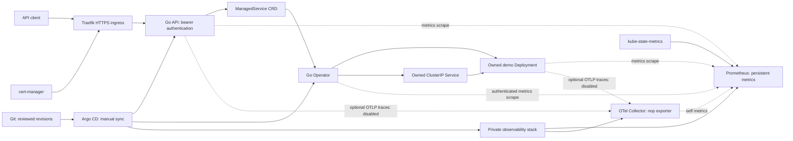

# Cloud-Native Service Control Plane

A Go control plane that turns authenticated API requests into Kubernetes-managed
services. Built to demonstrate desired-state reconciliation, constrained service
provisioning, GitOps delivery, and observable operation on a small cluster.

The portfolio scope includes a Kubernetes Operator, REST API, Go demo workload,
and deployment configuration for Argo CD, TLS, and private observability.
Deployment records describe previous validation; they are not a live service
availability guarantee. To try the code without a cluster, start with
[local development](#local-development).

## Architecture



The API writes desired state; the operator reconciles it asynchronously. Managed
workloads have internal Services, with no operator-created public Ingress.
Argo CD deploys platform components; it does not own API-created resources.

## Core Components

| Component | Implemented behavior |
| --- | --- |
| Operator | Watches `ManagedService`, Deployment, and Service resources; corrects drift, sets owner references, and reports conditions and observed generation |
| REST API | Bearer-authenticated create/list/get/delete in the fixed `applications` namespace; only the approved `demo-http` template |
| Demo workload | JSON message response, health/readiness endpoints, structured access logs, request IDs, metrics, and optional tracing |
| Delivery | SHA-tagged image workflows, digest-pinned deployment images, Kustomize packages, restricted Argo CD projects |
| Observability | Private Collector, standalone Prometheus, reduced kube-state-metrics, and six explicitly configured scrape jobs |

Technology: Go (version in `go.mod`), controller-runtime, Kubebuilder,
Kubernetes/K3s, Ginkgo/Gomega, Docker, GitHub Actions/GHCR, Kustomize, Helm,
Argo CD, Traefik, cert-manager, OpenTelemetry, and Prometheus.

## ManagedService Example

```yaml
apiVersion: platform.eoghanclancy.eu/v1alpha1
kind: ManagedService
metadata:
  name: portfolio-demo
  namespace: applications
spec:
  template: demo-http
  replicas: 1
  message: Hello from a ManagedService
```

Replicas default to `1` and must be `1`–`3`; the message is limited to 120
characters. The operator selects an administrator-approved digest-qualified
image. Status includes `Available`, `Progressing`, and `Degraded` conditions,
ready replicas, observed generation, and an internal endpoint. Kubernetes owner
references handle child cleanup; no external-resource finalizer is needed.
`Available` reflects ready replica count, not proof that a new rollout is complete.

## Local Development

Prerequisites: the Go version declared in `go.mod`, Git, Make, Bash, and curl.
The pinned Helm/Promtool download helpers target Linux amd64. Docker and Kind
are needed only for container builds and isolated end-to-end tests.

```bash
git clone https://github.com/etclank/cloud-native-service-control-plane.git
cd cloud-native-service-control-plane
go mod download
go build ./...
MESSAGE='Hello locally' go run ./cmd/demo-http
```

In another terminal:

```bash
curl http://localhost:8080/
curl http://localhost:8080/healthz
curl http://localhost:9090/metrics
```

The local HTTP processes bind all interfaces; use a trusted development machine.
Stop the demo with Ctrl+C. The API needs Kubernetes credentials and an
`API_TOKEN_FILE` containing at least 32 characters; it has no built-in development
credential. See the [API and security model](docs/security-model.md) and
[deployment guide](docs/application-deployment-guide.md) for cluster operation.

## Testing

```bash
make test                    # generates manifests/code, vets, runs unit + envtest tests
make lint-config lint        # configured golangci-lint and logging checks
go test ./...                # after make test has installed local tools and charts
go test -race ./...
go vet ./...
go build ./...
make observability-validate  # Helm lint, deterministic render, Argo Helm compatibility
```

Tests cover API validation/authentication, controller reconciliation and status,
telemetry, deployment security, GitOps allowlists, and chart rendering. Envtest
starts local API-server/etcd processes; it does not use the portfolio cluster.

`make test-e2e` creates and deletes a dedicated Kind cluster and builds local
images. Run it only in an isolated Docker development environment. It is a
separate CI job; ordinary `go test ./...` does not run the cluster E2E suite.
See [CONTRIBUTING.md](CONTRIBUTING.md) for generated-file rules.

## Deployment and GitOps

Deployment packages are environment-specific examples, not a one-command
installation for arbitrary clusters. See the [deployment guide](docs/application-deployment-guide.md)
and [reconstruction guide](docs/cloud-native-service-control-plane-build-guide.md).
Before deployment, configure your own DNS, ACME contact, ingress/storage classes,
API backend network destination, registry access, and token Secret. Build your
own images or arrange access to the referenced packages; public source visibility
does not make GHCR packages public.

- `config/default/`: operator, CRD, RBAC, and metrics policy.
- `kubernetes/platform/control-plane-api/`: API, TLS, ingress, and scoped RBAC.
- `deploy/observability/`: locked chart dependencies and private telemetry resources.
- `deploy/gitops/bootstrap/`: exact repository/destination/resource allowlists.

Operator, API, and observability Applications pin Git commits and use manual
synchronization, with automatic pruning/self-healing disabled. The registry
validation Application follows `main`. The observability Application combines
`values.yaml` with `values-h8.4b-candidate.yaml`; despite its historical filename,
that overlay enables Prometheus and kube-state-metrics. Default values alone
render the Collector foundation. Publishing a source commit does not advance
pinned Applications. See the [sync and rollback runbook](docs/argocd-sync-rollback-runbook.md).

## Observability

API and demo HTTP instrumentation produces bounded route/method/status metrics
and structured stdout logs. Optional OTLP trace export goes to the private
Collector; deployment configuration leaves it disabled. The Collector accepts
OTLP logs, metrics, and traces but discards them through `nop`: it is not a
persistent telemetry backend.

Prometheus independently scrapes itself, kube-state-metrics, the operator,
Collector self-metrics, API, and managed demo. The enabled overlay configures a
3Gi local-path PVC and 72-hour/2GB retention. There is no Grafana, Loki, Tempo,
Alertmanager, log aggregation, kubelet/cAdvisor scraping, or service-level alerting.

## Security

The API uses constant-time bearer-token comparison, a 4KiB JSON request limit,
validation, generic internal errors, HTTP timeouts, and bounded shutdown. Its
ServiceAccount can only create/get/list/delete ManagedServices in `applications`.
This is a single shared administrative token, not tenant authorization.

Platform containers run non-root with dropped capabilities, read-only root
filesystems, resource bounds, and RuntimeDefault seccomp. TLS terminates at
Traefik; Kubernetes, Argo CD, Collector, and Prometheus have no configured public
administrative ingress. Secrets are provisioned outside Git.

NetworkPolicy enforcement depends on the cluster dataplane. The configured
metrics ingress policies do not themselves grant ordinary Pod clients access to
API/demo HTTP ports. Operator metrics use bearer authentication but Prometheus
currently skips server certificate verification. These boundaries and deployment
prerequisites are detailed in the [security model](docs/security-model.md).

## Repository Structure and Documentation

| Path | Purpose |
| --- | --- |
| `api/`, `internal/controller/`, `cmd/main.go` | CRD schema and reconciliation |
| `internal/controlplaneapi/`, `cmd/control-plane-api/` | REST API and Kubernetes store |
| `internal/demohttp/`, `cmd/demo-http/`, `internal/telemetry/` | Workload and shared instrumentation |
| `config/`, `kubernetes/`, `deploy/` | Kubernetes, GitOps, and observability packages |
| `images/`, `.github/workflows/` | Container definitions and CI |
| `test/`, `internal/**/*_test.go` | Local and isolated cluster tests |
| [Documentation index](docs/README.md) | Guides, security boundaries, and historical evidence |

## Known Limitations and Production Evolution

The portfolio environment was a single VM/node. Local-path storage has no
replication or independently verified disaster recovery. There are no production
SLOs, scale claims, tenant isolation, API update endpoint, or pagination.
Argo CD itself has privileged cluster administration capabilities even though
application projects restrict what they may deploy.

Production evolution would start with trusted internal metrics TLS, explicit
application networking on the target CNI, identity-based authorization, quotas,
backup/restore exercises, failure testing, and capacity planning. Multi-node
availability and persistent telemetry backends are future work. See
[optional improvements](docs/optional-improvements.md).

## Project Status

Core platform implementation is complete for the portfolio scope. Historical
[platform](docs/h7-platform-deployment-closeout.md) and
[observability](docs/h8-observability-closeout.md) records describe deployment
validation at specific revisions. Current infrastructure health is not asserted.
The [public-review validation record](docs/public-review.md) separates local
checks from historical evidence and documents remaining limitations.

## License

No repository-level license file has been selected. Go source files carry Apache
2.0 headers, and third-party components retain their own licenses; this does not
resolve licensing for all repository content. No license is added or changed by
this review. See [third-party provenance](docs/third-party.md).
